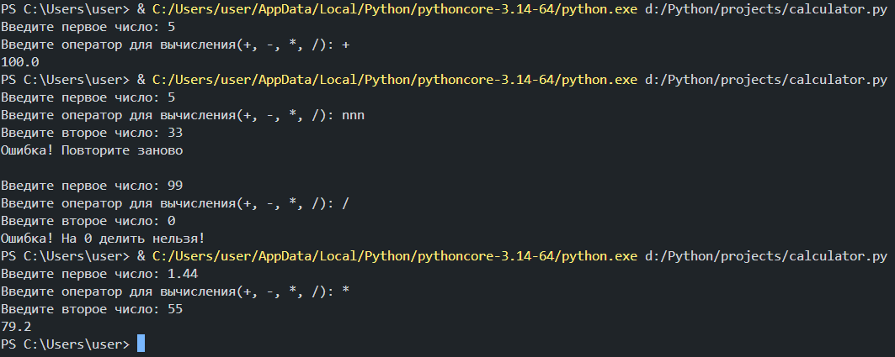

# Калькулятор
- Выполняет базовые арифметические операции(сложение, вычитание, умножение, деление)
-  Выдает ошибку при делении на ноль
-  Выдает ошибку и просит ввести заново данные при попытке подставить вместо арифметического знака что-то другое
-  Выдает ошибку при попытке подставить вместо первого/второго числа что-то другое
## Работоспособность

## Стек технологий
- Python
- VS Code
- Git/GitHub

[На главную](../README.md)